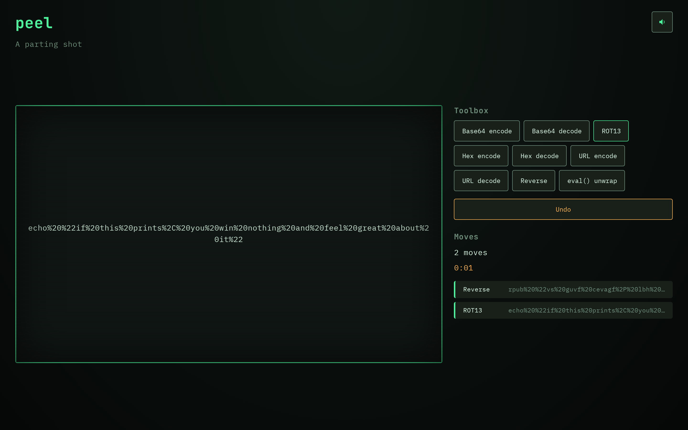

# Peel

**▶ Live demo — [apps.charliekrug.com/peel](https://apps.charliekrug.com/peel/)**

> Crack a new obfuscated one-liner every day.

[](https://github.com/ctkrug/peel/actions/workflows/ci.yml)
[](LICENSE)

Peel is a daily puzzle for people who like reading code they were never meant to read. Every day
it hands you one genuinely obfuscated shell or JavaScript one-liner, wrapped in a chain of real
encodings (base64, hex, ROT13, URL-encoding, string reversal, nested `eval`/`atob`). You pick
decode operations one at a time and watch each layer visibly unwind until the garbage resolves
into a short, readable, usually funny plaintext script. Solve it in the fewest moves.

Think Wordle, but the payoff is a real deobfuscation "aha" instead of five colored squares.



## Who it's for

Developers and CTF players who enjoy a quick daily brain-teaser, and anyone who has ever stared at
a suspicious one-liner and wanted to know what it actually does. If you like puzzles about how code
hides itself, this is a two-minute daily habit built for you.

## What makes it good

- **Real decoding, not a scripted animation.** Every obfuscated string is the actual output of the
  same transform engine you use to solve it. When you press "Base64 decode," it runs base64 decode
  on the current text. Off-path guesses that fail to apply shake the board instead of advancing.
- **One move at a time.** Nine reversible operations in the toolbox. Each correct move peels one
  layer with a CRT crossfade; a wrong or off-path move shakes and flashes red. Undo any move.
- **Scored and shareable.** A live timer freezes on solve, and the win screen hands you a
  spoiler-free result grid (one square per move, never the plaintext) to paste anywhere, Wordle-style.
- **One puzzle a day, no server.** Today's date resolves to the same hand-authored puzzle for
  everyone. Puzzles are static data, so the whole game ships as a static site with zero backend.
- **Terminal-native feel.** A phosphor-green CRT aesthetic, synthesized WebAudio sound effects
  (hover, success, fail, win) with a persisted mute toggle, and no binary audio assets.

## Play

Open the [live demo](https://apps.charliekrug.com/peel/) and start peeling. To run it locally:

```sh
npm install
npm run dev             # local dev server
```

Read one obfuscated string, pick the operation you think unwinds the outermost layer, and repeat.
The move history marks each step as on-path, an off-path decoy, or a failed decode, so you always
know where you stand.

## How a puzzle is built

Each puzzle is authored plaintext-first, then wrapped by running the engine's transforms in
reverse. The solution chain stored with the puzzle is the exact inverse of that wrapping, so the
game can verify at build time that the chain really does decode to the plaintext. See
[`docs/PUZZLES.md`](docs/PUZZLES.md) for the format and authoring rules.

## Stack

- Vanilla JavaScript, [Vite](https://vitejs.dev/) for dev and build, [Vitest](https://vitest.dev/)
  for unit tests.
- Canvas 2D for the puzzle board and its reveal animation. No UI framework.
- Zero backend. Puzzles are static data; the build is a plain static site.

## Development

```sh
npm install
npm run dev             # local dev server
npm test                # run the unit tests
npm run test:coverage   # unit tests with a line/branch coverage report
npm run build           # production build into dist/
```

The transform engine, game state, and UI helpers sit at 100% line and branch coverage; the
DOM/canvas wiring is verified by hand. See [`docs/ARCHITECTURE.md`](docs/ARCHITECTURE.md) for the
module map and [`docs/DESIGN.md`](docs/DESIGN.md) for the visual direction.

## License

MIT, see [LICENSE](LICENSE).

More of Charlie's projects → [apps.charliekrug.com](https://apps.charliekrug.com)
